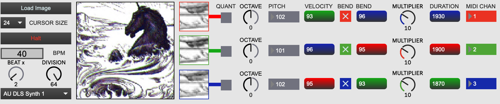
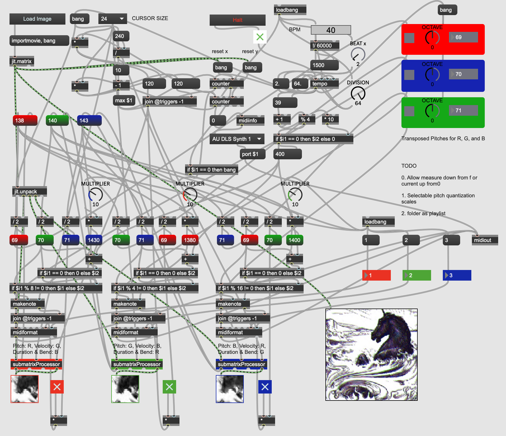

Image dimensions should be 240x240. Larger images will be sequenced along the first 240x240 pixels. Choose your MIDI output device using the `midiout` object. This is my first patch, and it's in early stages. Gradients make for a more "musical" experience in general.

Some sample images are included. I don't own the Rothko or Tim Curry saying "Space!".

